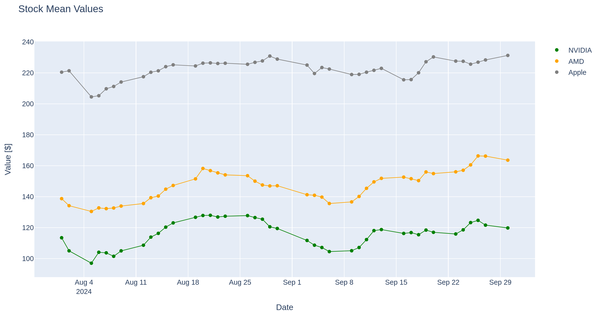

# fastapi-api-scrape
## Intro
This repository is structured for an academic assignment which requests a simple application using a variety of data handling and visualization techniques. The core functionalities include:
- Web Scraping
- API Calls
- Data Analysis
- Data Visualization
- Data Retrieval
- Graphical User Interface (GUI)

## Description
The code requires first creating a database in PostgreSQL for data storage:

1) Uses two API call methods to collect data and stores them automatically in the database (one API for the stock values of Nvidia, Apple, and AMD; one API for random news sites related to Nvidia news from Finnhub). The data are collected for a given date range.
2) Uses two scraping methods to collect data and stores them automatically in the database (one scraping of the Nvidia official site; one scraping of Yahoo Financial Times articles that contain the word "Nvidia"). The data are collected for a given date range. --> After 1 and 2, we have six tables in the database: three with the AMD, Apple, and Nvidia stock values, and three with the articles from different sources.
3) Analyzes the data using linear regression and attempts to predict Nvidia stock values.
4) Analyzes the data and assesses correlations between the sentiment scores of the different sources (from scraping and API) with a one-day shift.
5) Creates plots to compare the AMD, Nvidia, and Apple stock values for the selected date range.
6) Creates a three-axis plot with the Nvidia stock value, the dates, and the sentiment analysis of the articles from the three different sources.

## Run with gui
To achieve this in an interactive environment, the FastAPI library is used and everything is operated through the GUI. It is important to set up the PostgreSQL credentials in the utils/helpers.py function to enable Python to connect to the local database. Also, set up the necessary environment by typing into the terminal:

python3.11 -m venv .fastapi_env
pip install -r requests.txt
source .fastapi_env/bin/activate

To run the FastAPI application GUI, type into the terminal:

uvicorn main:app --reload

Then, navigate to http://127.0.0.1:8000/docs in the activated browser window.

## Analysis
Two fundamental and simple analysis methods are applied to extract insights and predictive capabilities from collected data.

Linear Regression Analysis:This method is used to attempt predictions of future Nvidia stock values based on past trends. Although the predictions from this model were not highly accurate, it provides an opportunity to explore the relationships between time and stock prices.

Correlation Assessment: This method focuses on examining the relationships between sentiment scores derived from various data sources (scraped content and API data) and stock prices. Correlations are assessed with a one-day lag to determine how sentiments from previous days' articles may influence Nvidia's stock price movements. 

## Visualization

## Further ideas

## Warning
In order to run the code locally, a .secrets folder is required with a keys.toml file, which contains all the necessary information, from links to local database credentials. The keys.toml file is structured as follows:

[database_credentials]
[original_nvidia_site]
[fin_times_site]
[api_finhub]

Each section includes the relevant links (main or supportive for nested articles) and credentials.

